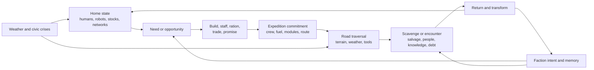

# System Map and Contracts

Version: 0.1 draft\
Purpose: define the state seams that let teams and agents improve one system without inventing private versions of the others.

## 1. Causal spine



The mandatory trace for a shipped feature is:

`upstream state → player decision → state transition → visible consequence → saved consequence`

A feature with no trace is presentation-only, tooling-only, or disconnected. It must be labeled accordingly rather than pretending to deepen the simulation.

## 2. Architectural layers

### Authoritative state

Plain versioned data with stable IDs. It owns the facts: inventory, buildings, human and robot residents, jobs, vehicle configuration, faction memory, route state, clock, and random streams.

### Rules and commands

Deterministic-enough state transitions such as `PlaceBuilding`, `AssignWorker`, `CraftModule`, `DepartExpedition`, `ResolveEncounter`, and `InstallRepair`. Commands validate preconditions and emit domain events.

### Presentation

Scenes, meshes, animation, particles, audio, UI, and camera interpret state. Presentation may interpolate, pool, aggregate, or omit actors. It never becomes the only place a gameplay fact exists.

### Tools and content

Data editors, importers, validators, balance tables, encounter definitions, asset manifests, and agent work packets. Tools may generate output but cannot bypass runtime validation.

## 3. State domains

| Domain | Owns | Consumes | Publishes |
|---|---|---|---|
| World | seed, clock, weather fronts, region graph, discovered sites | elapsed ticks, route actions | forecast, hazard state, route availability |
| Settlement | plots, buildings, roads, networks, storage, policies, construction | resources, labor, weather, faction modifiers | production, demand, failures, civic capacity |
| Population | human households/cohorts, named specialists, humanoid utility robots, resident composition, needs/maintenance, health/condition, roles, affiliations | housing, food, water, power, parts, safety, policies, events | labor, expertise, morale/cohesion, migration/recruitment, stories |
| Logistics | stockpiles, requests, route costs, priorities, and the selected delivery abstraction | producer outputs, consumer demands | deliveries, bottlenecks, unmet requests |
| Vehicle | chassis, module sockets, capability tags, condition, fuel, cargo, crew | crafted modules, supplies, damage | range, route verbs, cargo capacity, expedition readiness |
| Expedition | manifest, route, clock policy, encounter state, return payload | vehicle capability, world hazards, crew, faction state | salvage, injuries, knowledge, obligations, route changes |
| Faction | doctrine, needs, assets, intent, relationship memories, promises | player actions, trade, time, regional pressure | offers, prices, access, aid, sanctions, movement, conflict |
| Crisis | trigger, forecast, severity, affected systems, response options | state thresholds, clock, authored conditions | modifiers, objectives, damage, civic/faction consequences |
| Progression | known recipes, institutions, road access, civic milestones | discoveries, choices, relationships, construction | new verbs, alternatives, capacities, visual growth |
| Audit | command IDs, state hashes, warnings, migrations, build/version | every authoritative transition | debug trace, test evidence, save diagnostics |

## 4. Identity and reference law

Every persistent object receives a stable typed ID at creation. Simulation IDs are allocated from persisted per-type monotonic counters under the world identity; random UUID creation is not used for authoritative simulation ordering:

- `world:<world-id>:settlement:<counter>`
- `world:<world-id>:building:<counter>`
- `world:<world-id>:household:<counter>`
- `world:<world-id>:specialist:<counter>`
- `world:<world-id>:robot:<counter>`
- `world:<world-id>:vehicle:<counter>`
- `faction:<content-id>`
- `site:<content-id-or-uuid>`
- `world:<world-id>:promise:<counter>`

Save slots and external packages may use UUIDs because they do not affect simulation order. Runtime object references, scene paths, array positions, and prefab instance IDs are not persistent identity. Content definitions have immutable content IDs; save migrations translate retired IDs.

## 5. Open city-building grammar

D-0030 is intentionally unresolved because it determines what the player actually manipulates and how much architecture is justified.

The M1 ugly toy compares and then selects:

- **placement**: individual buildings on a restrained snap grid, freeform placement, district stamps, or a hybrid;
- **logistics**: explicit carriers, route-capacity abstraction, or visible local carriers backed by aggregate offscreen delivery;
- **population**: human individuals vs households/cohorts, robot individuals vs managed fleets, and how named specialists or robots sit above either abstraction;
- **scale**: one district, one evolving city, or multi-settlement management.

Recommended slice hypothesis: individual functional buildings on a hidden/restrained snap grid; physical roads; visible nearby carriers with aggregate offscreen resolution; cohorts plus named specialists; one district-scale city. This is a test condition, not a ratified architecture.

D-0022 exclusively owns camera projection, rotation, zoom, comfort, and information legibility. The comparison holds one documented provisional D-0022 camera setup constant so D-0030 does not hide a second camera decision inside city grammar.

## 6. Provisional vertical-slice economy

Keep the proof economy intentionally small.

### Stored resources

| Resource | Player meaning | Primary sources | Primary sinks |
|---|---|---|---|
| Water | immediate civic survival | condenser/turbine, trade | households, growhouse, expedition |
| Food | population stability | growhouse, scavenging, trade | households, expedition |
| Salvage | raw recovered matter | scrap yard, road sites | sorting/crafting, construction |
| Parts | maintained complexity | machine shop, rare finds | buildings, modules, repairs |
| Fuel | home-vs-horizon bottleneck | processor, trade, caches | city machinery, vehicle travel |
| Medicine | recovery and risk buffer | clinic recipe, rare finds, faction trade | injuries, crisis response |

### Capacities, not stockpiles

- **Labor**: available work time by role and expertise.
- **Power**: network capacity and load; not a crate carried by workers.
- **Storage**: typed physical capacity.
- **Morale / civic trust**: derived condition with named causes, not a spendable mana bar.

Every resource requires a visible source, sink, storage rule, shortage behavior, and UI explanation. A resource cannot enter the game solely to make one recipe longer.

## 7. Production contract

A production definition contains:

- stable recipe ID and content version;
- input quantities and delivery requirements;
- output quantities;
- work duration in simulation ticks;
- labor role/skill requirement;
- power/load requirement;
- operating conditions and weather modifiers;
- byproducts or pollution if present;
- presentation cues for idle, waiting, working, output-full, and broken;
- explainable reason when stalled.

The slice uses no more than three short production chains. The UI must answer “why is this stopped?” in one interaction.

## 8. Human and robot colony contract

Ratified under D-0037:

- a playable colony can be human-only, humanoid-utility-robot-only, or mixed;
- authoritative resident membership and saves must be capable of representing all three sets without inventing a hidden mandatory human.

The remaining contract in this section is a **provisional D-0039 mechanical-composition hypothesis**. WP-0002 may implement it only if the creator ratifies the matching value and accepts the packet; otherwise the packet branches before code.

The first implementation keeps one resident ledger with a typed embodiment/category and stable ID. A derived `human-only`, `robot-only`, or `mixed` classification is computed from the authoritative members; it is never a second editable truth that can drift from the resident set. Humans and robots can fill roles only when their capabilities and current state satisfy the job contract.

Provisional differentiated needs model, to be tested rather than treated as lore:

- humans consume water, food, medicine, housing, rest, and safety;
- robots consume power, parts, maintenance capacity, and protected operating/storage space;
- mixed colonies share logistics and civic infrastructure while creating different labor coverage, bottlenecks, policies, relationships, and stories;
- one composition cannot be the strictly superior difficulty setting. Each needs at least one genuine capability and one genuine dependency.

Robot personhood, consciousness, ownership, manufacture, reproduction, governance, and relationship mechanics remain open fiction and ethics decisions. Until those decisions are authored, agents must not silently describe every robot as property, every robot as a citizen, or mixed settlement life as conflict-free.

### Layered representation

Use layered simulation:

- **Named human specialists and named robots** retain identity, skills/capabilities, injuries or condition, relationships if authored, assignments, and history.
- **Human households/cohorts** retain needs, housing, affiliations, and workforce contribution without requiring every person to be fully simulated.
- **Robot units or bounded fleets** retain chassis/model, capability tags, condition, energy, maintenance, assignment, affiliation/ownership status once authored, and history.
- **Visual residents** are pooled representatives bound to an authoritative human, robot, cohort, fleet, or job state while visible.

No design may depend on thousands of continuously pathfinding GameObjects. Humans and robots must still feel present through schedules, visible work, names/identifiers, requests or maintenance signals, and neighborhood change.

## 9. Vehicle contract

A vehicle is a persistent civic asset, not a disposable avatar. Its state includes:

- chassis identity and handling profile;
- named history and cosmetic wear;
- fuel, condition, cargo mass/volume, and passenger capacity;
- crew assignments;
- mutually constrained module sockets;
- capability tags such as `winch`, `water-harvest`, `tow`, `storm-seal`, `rescue`, or `long-range`;
- damage and repairable subsystems;
- expedition records.

Modules must do at least one of:

1. unlock a new action;
2. open a route class;
3. change a meaningful capacity tradeoff;
4. create a new civic use on return.

A module whose only purpose is a small percentage increase fails the first design review.

## 10. Road and expedition contract

Recommended shape under open D-0007 and D-0029:

- A **regional route graph** owns discovery, distance, hazards, control, travel cost, and faction access.
- **Compact authored road zones** own tactile traversal, salvage-tool interactions, weather, and selected encounters; control can be direct or command-based until D-0007 is ratified.
- The expedition manifest is authoritative across mode transitions.
- Entering/exiting a driving zone cannot duplicate cargo, crew, time, damage, or random outcomes.
- The city-time policy is data-driven until D-0008 is ratified.

Scavenging is spatial and tool-based. The player reads a place, positions the vehicle, commits time/risk/capacity, and changes the site. It is not a field of dozens of generic loot containers.

### Cross-mode ownership transaction

Cargo, crew, vehicle condition, and expedition time have exactly one authoritative owner. Every city/road transition uses a persistent transaction ID, idempotency key, and last-applied command sequence:

```text
prepared → city-debited → road-owned → return-pending → city-credited → finalized
```

- `prepared`: the manifest is validated; the city still owns all items.
- `city-debited`: reserved inventory and crew are removed once and transaction state is saved.
- `road-owned`: the expedition is the sole owner; a retry cannot debit again.
- `return-pending`: the outcome is frozen and no longer mutable by road presentation.
- `city-credited`: payload, damage, crew, time, and faction events are applied once.
- `finalized`: reservations and replay records may be compacted only after a later safe save.

Recovery resumes the recorded phase. A command whose idempotency key has already been applied returns the prior result rather than repeating effects. An unsupported mid-transition save request waits for the next authoritative checkpoint instead of writing ambiguous state.

## 11. Faction contract

Faction memory is event-backed, not a single reputation number. The minimum model stores:

- witnessed action or fulfilled/broken promise;
- who was affected;
- magnitude and decay rule, if any;
- doctrine tags that change interpretation;
- resulting trust, grievance, obligation, dependence, or fear;
- behavioral consequence and player-visible explanation.

A faction also runs a minimal real-time loop independent of the player:

```text
need → telegraphed intent → autonomous action → world/economic consequence → player response
```

The vertical-slice faction must therefore:

- have one concrete need and doctrine;
- signal its intention to reach the depot;
- move a scout/claim through regional state even if the player waits;
- alter route, resource, recipe, institution, or access state through that action;
- change at least two later behaviors after the encounter—for example price/access plus aid/sanction—rather than only moving a meter;
- offer one doctrine-shaped solution that changes a city recipe, maintenance burden, promise, or logistics choice.

## 12. Crisis contract

A fair crisis provides:

- a readable forecast or causal warning;
- a known affected system;
- at least two viable response classes;
- escalating, inspectable consequences;
- an end condition;
- aftermath that becomes state rather than disappearing text.

Hidden dice may vary detail, but they cannot invalidate informed preparation.

## 13. Event, randomness, and debug contract

- Authoritative randomness is counter/key-based and versioned, keyed by world, event type, entity, and decision context; adding an unrelated random draw cannot reroll later outcomes.
- Commands receive monotonic tick and sequence IDs.
- Important transitions emit structured domain events.
- Saves contain a current snapshot plus a bounded diagnostic event tail; the game is not required to rebuild all state from the full event history.
- Debug builds can export a redacted state snapshot and causal trace for an agent to reproduce.
- Canonical state hashes sort collections by stable ID, include only declared authoritative fields, and use integers/fixed point or explicit quantization for continuous values.
- Transient rendering and raw vehicle-physics state are excluded from exact hashes. Physics-derived gameplay outcomes are captured as bounded authoritative events at checkpoints; tolerance/trace comparison is required until deterministic quantization is proven.
- Scenario evidence records runner version, commit, engine/packages, content hash, seed/counters, starting-save hash, input hash, OS/hardware, locale, quality, clock/physics settings, worker count, and hash algorithm/version.
- Automated simulations log invariant violations, stalled economies, negative inventories, orphan references, and non-terminating crises.

## 14. Feature interface test

Before implementation, every feature answers:

1. Which domain owns its truth?
2. What stable IDs does it read or write?
3. What command changes it?
4. What domain events does it emit?
5. Which two other systems does it affect?
6. How is the consequence shown to the player?
7. What is saved and migrated?
8. What is its performance budget?
9. How is failure detected and rolled back?

If these answers are missing, the feature is not ready for an implementation agent.
