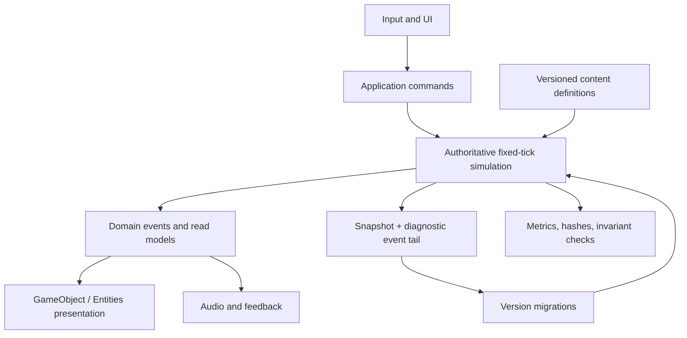

# Technical Architecture

Version: 0.1 draft\
Status: provisional until an engine spike passes\
Known creator hardware: Apple M3 Max, 16 CPU cores, 40 GPU cores, 48 GB RAM, Metal, macOS 15.7.7

## 1. Recommendation

Use **Unity 6000.3.19f1 ARM64** as the exact WP-0001 editor candidate on native Apple Silicon, installed through **Unity Hub 3.19.5** with **Mac Build Support (IL2CPP)**. Pair it with **Xcode 26.3**, **URP 17.3**, **Unity Test Framework 1.6**, and Rosetta 2 as required by Unity's Apple Silicon system requirements. Use Mono for iteration, but treat only a native IL2CPP ARM64 standalone build as acceptance authority. Begin the authoritative simulation in plain deterministic C#; adopt Jobs, Burst, or Entities only after profiling identifies a hot path and an ADR proves the benefit.

This tuple is D-0047's provisional spike target, not an installation approval or engine ratification. WP-0001 must archive the exact installers/terms, package resolution, support lifecycle, Xcode compatibility, relevant known issues, and rollback materials. Unity 6 supports Apple M1-or-newer Macs and Metal, but those general claims do not substitute for patch-specific proof. [Unity 6000.3.19f1 release](https://unity.com/releases/editor/whats-new/6000.3.19f1), [Unity 6 lifecycle](https://unity.com/releases/unity-6), [Unity 6.3 system requirements](https://docs.unity3d.com/6000.3/Documentation/Manual/system-requirements.html), [Unity 6.3 command line](https://docs.unity3d.com/6000.3/Documentation/Manual/EditorCommandLineArguments.html)

WP-0003 separately authorized the already-installed Unity `6000.5.4f1` Editor
for its completed bounded local bootstrap under an exact sealed local boundary
and conditional first-use gate. WP-0003 is now `released` and its reservation
is released. WP-0002 is the sole active A1 packet under its protected Stage C
boundary. Its canonical durable checkout is
`/Users/sasha/Documents/Sasha the Atomic Land Pirate/Development/sasha-the-land-pirate`
and its exact Unity project is the `Game` child. The sealed v1 local-operator
receipt `RR-WP0002-LOCAL-OPERATOR-20260717` and amendment remain append-only
historical evidence with disposition `superseded-unclosed-never-effective`.
Their absent `docs/evidence/WP-0002/local-operator-amendment/authority.json`,
`docs/evidence/WP-0002/local-operator-amendment/pre-merge.json`, and
`docs/evidence/WP-0002/local-operator-amendment/complete.json` paths are
permanently forbidden. The only forward route is the v2 successor amendment
`A1B-WP-0002-LOCAL-OPERATOR-SUCCESSOR-20260718`, transaction
`WP0002-LOCAL-OPERATOR-SUCCESSOR-20260718`, and receipt
`RR-WP0002-LOCAL-OPERATOR-SUCCESSOR-20260718`. Only after its complete
authenticated online transaction and a separate protected exact-three-report
evidence-closure merge does that successor permit visible Computer Use in
Unity Hub bundle
`com.unity3d.unityhub` and Editor bundle `com.unity3d.UnityEditor5.x` to
add/open/switch that exact project, approve only the receipt-bound Codex Bridge
client whose visible OS publisher/path and application version/build match,
and inspect non-secret Unity state. The prior host signature observation is
context-limited and the UI does not prove a CDHash. It cannot mutate
Bridge tools or configuration. Implementation remains restricted to the
five named MCP tools. Only for the exact successor control PR head and patch may
`wp0002-policy` be temporarily nonrequired; all other protections remain, it
must be restored to required checks `validate`, `wp0002-core`, and
`wp0002-policy` within 600 seconds of the successor control squash, and the
separate closure PR must pass all three. The historical WP-0003 exception and
this narrow successor UI amendment do not amend WP-0001's candidate tuple,
ratify the production engine,
or waive later IL2CPP, Xcode, package, performance, and rollback proof.

Renderer hypothesis to test:

- URP Forward+;
- native ARM64 macOS player;
- GPU instancing and, only where compatibility passes, GPU Resident Drawer for repeated meshes;
- baked lighting only for immutable environment at first; dynamic player-built city objects use a measured lighting/probe path;
- scalable shadows, foliage, particles, crowd density, and resolution;
- GPU lightmapping on Apple Silicon, because Unity does not support CPU lightmapping there. A representative city spike must include placed buildings, per-instance faction/condition data, LODs, shadows, and probes; one calibration mesh cannot ratify the batching path. [URP GPU Resident Drawer](https://docs.unity3d.com/6000.0/Documentation/Manual/urp/gpu-resident-drawer.html)

## 2. Alternatives

| Engine | Position | Why | Decisive risk |
|---|---|---|---|
| Unity 6.3 LTS | Recommended candidate | Strong Mac/Metal support; balanced stylized rendering; optional Jobs/Burst/Entities; batch automation; mature tooling | Proprietary terms; patch-specific Metal issues; license management for automated machines |
| Godot .NET 4.7.1 | Runner-up | MIT ownership; official headless workflow; Universal Apple Silicon/Metal build; direct glTF orientation | More custom work for large data-oriented simulation and production tooling |
| Unreal 5.x | Not default | Highest cinematic ceiling; Mass, navigation, save, and automation are capable | Heavy workflow; Mac renderer limitations in flagship features; integration complexity; royalty exposure |

The exact fallback/comparison candidate is **Godot .NET 4.7.1 commit `a13da4feb`**, Universal macOS ARM64/x86_64, matching .NET export templates, .NET SDK 8+, Forward+ native Metal, official headless CI, and MIT license. It must run the same representative benchmark before engine ratification; it is not installed or preselected. Unreal becomes reasonable only if the product pivots toward close-up cinematic exploration whose visual ceiling justifies it. [Godot license](https://godotengine.org/license/), [Godot system requirements](https://docs.godotengine.org/en/4.7/about/system_requirements.html), [Unreal macOS requirements](https://dev.epicgames.com/documentation/unreal-engine/macos-development-requirements-for-unreal-engine)

## 3. Constitutional technical boundaries

Even if Unity is ratified:

- Unity Terms §17.2(ff) is a hard operating gate. An agent or CI runner may not directly invoke Hub, Editor, or Unity CLI unless Unity has documented Authorized Agentic Access for the exact identity, runner, and use. WP-0002's creator-authorized visible-UI operator successor is limited to the exact installed app bundles, canonical project, trusted Bridge client, and non-secret inspection, and becomes effective only after its exact-three-report protected closure; it grants no shell, CLI, batchmode, headless, executable, CI, install, or different-project authority. If that cannot satisfy later engine proof, supersede the applicable packet with the Godot fallback. Creator repository/CI permission cannot waive vendor terms.

- Unity scenes and GameObjects are presentation and authoring containers, not canonical game state.
- Save data never serializes scene paths, prefab instances, `MonoBehaviour` object graphs, or raw ECS chunks.
- Core rules compile in a non-Unity C# project/assembly with injected clock, randomness, storage, and logging interfaces; it cannot reference presentation assemblies or `UnityEngine`.
- Hot simulation domains may use Jobs/Burst/Entities behind adapters only after a measured ADR; engine, renderer, and optimization architecture are separate decisions.
- Content definitions use stable IDs and versioned schemas.
- A native player build, not Editor Play Mode, is the performance authority.
- Online Unity services are optional; the game must remain launchable and saveable offline under the recommended D-0021 default.

## 4. Proposed repository shape

```text
/
  AGENTS.md
  README.md
  .gitignore
  docs/
    foundation-v0.1/                  # current draft constitution/control plane
      00-GAME-CONSTITUTION.md
      governance/
      ledger/
      schemas/
      scenarios/
      work-packets/proposed/
      tools/
    decisions/
    adr/
    evidence/<packet-id>/
    known-issues/
    licenses/
    manifests/
    performance/
  Game/
    Assets/Game/
      Bootstrap/
      Application/
      Presentation/
      UI/
      Content/
      Audio/
      Art/
      Tests/
      Editor/
    Packages/
    ProjectSettings/
  SimulationCore/                    # authoritative engine-independent C#
  SaveContracts/                     # accepted envelope/section/migration code
  ContentSource/
    Blender/
    Textures/
    Audio/
    Incoming/
    Manifests/
  Tools/
    AssetPipeline/
    ScenarioRunner/
    SaveInspector/
    Validation/
  Tests/
    BuildSmoke/
    GoldenSaves/
    GoldenVectors/
    Scenarios/
    Performance/
    ValidationFixtures/
    VisualReferences/
  BuildArtifacts/<packet-id>/
```

Only `AGENTS.md`, `README.md`, `.gitignore`, and `docs/foundation-v0.1/` existed before WP-0003 activation. WP-0003 subsequently created only its exact declared seams before it was released and its reservation was released. At the current Stage B A0 handoff, no active packet may create additional seams: accepted WP-0002 is inactive and unreserved until its protected Stage C activation. Every later seam still requires a separately accepted and activated packet that names its paths. The nested foundation remains the authority until a creator-approved migration packet atomically relocates it and updates every link, receipt, hash, gate, and agent instruction; agents must not create duplicate root `ledger/`, `governance/`, or `work-packets/` authorities from this diagram.

Unity-generated `Library`, `Temp`, `Logs`, `Obj`, user settings, and local build caches never enter version control. Source assets, manifests, accepted reference captures, migrations, and packet-bounded evidence do. Unity folder creation also writes adjacent `.meta` files; a packet that authorizes a new `Assets/` subtree must declare the required parent and child `.meta` paths rather than treating them as invisible side effects.

## 5. Runtime composition



### Simulation cadence

- Authoritative economic/faction simulation begins at a configurable 5–10 Hz.
- Presentation targets 60 fps and interpolates between authoritative states.
- Vehicle physics runs at a pinned engine physics cadence while emitting bounded, quantized authoritative results at checkpoints. Raw transient wheel/body state is not part of the canonical cross-platform hash until a deterministic contract is proven.
- No gameplay rule uses render-frame delta as its only clock.
- Clock policies for city, road, pause, and alerts are data/config until D-0008 is ratified.
- Authoritative IDs come from persisted monotonic allocators, randomness is counter/key-based and versioned, collections hash in stable-ID order, and continuous values declare fixed-point or quantization rules.

### Simulation tiers

- **Tier A**: selected/near-camera actors with full animation, steering, and interaction.
- **Tier B**: visible lightweight actors with budgeted navigation.
- **Tier C**: offscreen individual or household state without rendered actors.
- **Tier D**: distant faction/expedition state machines.

Promotion/demotion cannot change inventory, health, identity, schedule outcome, or elapsed time.

## 6. Navigation and logistics

- Under the recommended but open D-0029 topology, a custom regional graph owns route discovery, cost, access, and strategic travel.
- City placement and delivery behavior remain behind D-0030's grammar spike; do not commit to explicit carriers or aggregate delivery before that comparison.
- Unity NavMesh/AI Navigation owns local visible pedestrian paths and selected encounter actors.
- Path requests are queued and budgeted across frames.
- If hybrid logistics is selected, offscreen deliveries resolve through route costs and travel time rather than invisible `NavMeshAgent`s.
- Dynamic blockers invalidate bounded graph regions rather than forcing a global rebuild.
- Road zones use compact authored scenes under the current recommendation; D-0007 decides direct driving versus command.

## 7. Save constitution

### Save Envelope v1

The logical header contract in [`schemas/save-header.schema.json`](schemas/save-header.schema.json) is codec-independent. Envelope v1 has one exact physical representation; an implementation is non-conforming if it invents padding, native-width integers, alternate JSON formatting, or another checksum domain.

#### Physical byte contract

All integer fields are unsigned **little-endian**. Every offset is an absolute byte offset from byte `0` of the file. The file is laid out without padding:

| Range | Width | Meaning |
|---|---:|---|
| `0..7` | 8 | ASCII `WSLDSV01` |
| `8..9` | 2 | envelope format version; exactly `1` |
| `10..11` | 2 | flags; exactly `0` in v1 |
| `12..15` | 4 | canonical header byte length |
| `16..23` | 8 | total file byte length, including the footer |
| `24..31` | 8 | reserved; every byte must be zero |
| `32..` | bounded | canonical header, then contiguous encoded sections |
| final 40 bytes | 40 | ASCII `WSLDEND1` followed by the raw 32-byte whole-envelope SHA-256 |

The header is UTF-8 JSON in [RFC 8785 JSON Canonicalization Scheme](https://www.rfc-editor.org/rfc/rfc8785) form. Its byte length is at most **1,048,576 bytes**. The whole file is at most **536,870,912 bytes (512 MiB)**. There are at most 64 sections; one encoded section is at most **134,217,728 bytes (128 MiB)**, one decoded section is at most **268,435,456 bytes (256 MiB)**, and the aggregate decoded length is at most **1,073,741,824 bytes (1 GiB)**. The aggregate encoded and decoded totals are repeated in the header and must equal checked sums, not unchecked machine arithmetic.

The first section begins at `32 + header_length`. Descriptors are sorted by offset; sections are back-to-back, non-overlapping, and end exactly where the 40-byte footer begins. A section checksum is SHA-256 over its **encoded bytes as stored**, before decompression. The decoder must enforce both the declared per-section decoded length and the aggregate decoded cap while streaming; it rejects early or excess output.

To calculate the whole digest:

1. set `whole_envelope_digest` in the logical header to 64 ASCII zeroes;
2. canonicalize that header to UTF-8 bytes and build the final 32-byte preamble using the resulting lengths;
3. hash `preamble || zeroed-canonical-header || encoded-section-0 || ... || encoded-section-n`;
4. replace the zero field with the 64-character lowercase hex digest and canonicalize again; its byte length must be unchanged;
5. write the 8-byte footer magic and the same digest as 32 raw bytes last.

On read, the stored header must byte-for-byte equal its re-canonicalized form. The loader validates the preamble, actual file length, header bound/schema, checked aggregate lengths, unique section names, offsets, footer, whole digest, and encoded-section checksums **before** exposing state. It never allocates directly from an unvalidated length.

#### Logical header contract

The header binds:

- slot UUID, a save UUID that is stable for the entire lineage, strictly increasing contiguous generation, previous-generation digest, and compare-and-swap token. Every non-genesis generation in one lineage repeats the same `slot_id` and `save_id`; `previous_generation_digest` is the immediate predecessor generation header's `whole_envelope_digest`, or `null` only for generation 1/genesis;
- immutable `lineage_provenance`, repeated byte-for-byte as the same logical object in every generation of the lineage. A normal new game records `new-game` with no source. A rollback/recovery continuation records a new generation-1 `rollback-fork` or `recovery-fork`, the exact source product/slot/save/generation/whole-envelope digest, and the incident/quarantine manifest hash. A fork's new `slot_id` and `save_id` must both differ from the source;
- root save-schema version, save-contract manifest hash, codec/compression tuple, exact game build, content manifest, engine/tool tuple, and read compatibility;
- world seed, authoritative tick, stable-ID allocator next values, and each random stream's registered algorithm/version/key/counter;
- a registered canonical-state encoding/version and numeric quantization policy plus its authoritative-state digest;
- independent `world_mode`, `clock_policy_id`, pause state, rational speed, and structured transition `{id,type,phase}`;
- versioned section descriptors, checked totals, migration receipts, and the whole digest.

The candidate random algorithm, canonical-state encoding, and numeric policy are pinned only when WP-0001 publishes a cross-runtime golden vector. They cannot be changed behind an existing identifier.

### Body

State is stored as explicit versioned arrays/maps keyed by stable IDs:

- world, ID allocators, clocks, and random counters;
- settlements, buildings, selected logistics representation, inventories, and jobs;
- households/cohorts, specialists, needs, injuries, and history;
- original humanoid utility robots, chassis/capabilities, energy/condition, maintenance, assignments, affiliation/ownership status once authored, and history, including an explicit colony composition that round-trips human-only, robot-only, and mixed states;
- vehicles, modules, condition, cargo, and crews;
- expedition ownership transactions, discovered routes, depleted sites, and last-applied idempotency sequence;
- factions, promises, intentions, autonomous actions, memories, and prices/access;
- crises, progression, objectives, and content references;
- bounded diagnostic event tail.

Prototype sections may use readable JSON. Scale tests may justify a versioned binary codec later; changing codec cannot change logical meaning. Canonical equality uses the registered encoding, sorts collections by stable ID, and applies the registered numeric policy; presentation and raw transient physics are excluded.

### Save version law

Envelope, root, slot-pointer, retention-anchor, codec, and section versions are independent:

- `envelope_format_version` changes for framing, integer layout, canonicalization, checksum-domain, or footer changes;
- `save_schema_version` changes when a header member or root meaning changes;
- `pointer_format_version` changes when pointer fields, digest domains, or pointer-to-header equality semantics change;
- `anchor_format_version` changes when pruning authorization, protected-root semantics, receipt fields, or receipt-digest domains change;
- every section has its own schema version; any structural or semantic change to an accepted section requires a version bump and reader/migration coverage;
- codec and compression versions may change representation without changing logical state.

The first accepted WP-0001 golden save freezes envelope v1, root schema v1, pointer v1, and retention-anchor v1. A later durable-save packet cannot silently redefine any of them. A new named section may enter under root v1 only when the save-contract manifest gives its exact schema, criticality, and deterministic absence default. An existing section does not gain an undeclared field under the same version. Unknown authoritative sections make the save read-incompatible and prohibit rewriting it; unknown recoverable-diagnostic sections may be skipped. WP-0002's `last-bearing-dev-v1` profile is an explicit disposable pre-envelope exception: it never reads, rewrites, or migrates WP-0001 fixtures and makes no production-compatibility claim. The envelope/root/pointer/anchor v1 and migration laws remain mandatory for every later durable save.

### Durable write and generation protocol

1. Serialize save requests per writable slot lineage under a writer lock; coalesce autosave requests and assign the next contiguous generation and a new CAS token. Generation 1 is genesis; every later generation is exactly its predecessor generation plus one. An older generation opened for rollback or recovery inspection is read-only and can never become this writable head.
2. At a supported authoritative checkpoint, capture an immutable snapshot including the current ownership-transaction phase.
3. Serialize with hard size/allocation limits to `slot-<generation>.save.tmp` in the same directory/filesystem as the slot.
4. Write preamble, header, sections, whole digest, and footer; flush userspace buffers and `fsync` the file.
5. Reopen the temporary generation, validate every bound/digest/reference, and run the logical invariant check.
6. Rename the temporary generation atomically to its immutable generation name and `fsync` the containing directory.
7. Write and `fsync` a tiny new `slot.current.tmp` pointer containing generation and digest; atomically rename it to `slot.current`, then `fsync` the directory again.
8. Retention may advance a protected pruning anchor only through the separate protocol below. It cannot delete any generation required to traverse from the current head back to the active protected anchor (inclusive), any rollback/migration/golden generation, or any unrecognized/forked file. Disk-full, cancellation, or crash leaves a previously valid pointer-rooted or anchor-rooted chain recoverable.
9. Manual and autosave writers never mutate the same generation. A stale CAS token retries from current state rather than overwriting newer progress.

`slot.current` is canonical UTF-8 JSON conforming to [`schemas/save-slot-pointer.schema.json`](schemas/save-slot-pointer.schema.json), capped at 16 KiB. Its `product_id`, `slot_id`, stable lineage `save_id`, `generation`, `cas_token`, and `updated_at` equal the selected generation header fields exactly. Its `generation_digest` is that header's `whole_envelope_digest`; its `previous_generation_digest` is that header's `previous_generation_digest`; and `previous_generation` is `generation - 1` whenever that digest is non-null, otherwise null. Its `pointer_digest` is SHA-256 over the RFC 8785 canonical pointer with that field replaced by 64 zeroes. It names the selected immutable writable head but is not itself authoritative game state. Any cross-field or digest mismatch invalidates the pointer even when the named envelope is valid. Every load also proves that the selected generation traces through a complete non-forked same-slot/same-save chain to a permissible genesis or active protected-anchor root; a syntactically valid pointer never excuses missing ancestry.

#### Protected pruning anchor

Retention is a crash-safe transaction, not an age-based file deletion:

1. Under the slot writer lock, choose an anchor generation `A` that is a validated ancestor of the durable current head `H` and has no rollback/migration/golden-protected generation in the prefix that would become eligible for pruning. Fully validate the one non-forked chain from the existing protected root (genesis or the active anchor) through `H`, including every digest link, pointer cross-field, slot/save identity, and generation increment.
2. Write a canonical receipt to `slot-<A>.retention-anchor.tmp` conforming to [`schemas/save-retention-anchor.schema.json`](schemas/save-retention-anchor.schema.json). The receipt embeds the exact canonical pointer object that selected `H`, repeats that object's `pointer_digest`, and binds `A`'s stable save ID, whole-envelope digest, immediate predecessor generation/digest, the validated head, retention policy/tool, and highest generation that may be pruned. It never relies on mutable `slot.current` remaining unchanged.
3. Flush and `fsync` the temporary receipt, reopen it, validate its schema and zero-field receipt digest, independently validate the embedded pointer's zero-field pointer digest, and prove every anchor/pointer/head equality before atomically renaming it to immutable `slot-<A>.retention-anchor` and `fsync`ing the directory. The anchor receipt and generation `A` are now a protected pair; later pointer advancement cannot erase the proof used to authorize pruning.
4. Only after step 3 is durable may retention delete confirmed members of `A`'s ancestor prefix with generation less than `A`. It deletes no file at or after `A`, no protected rollback/migration/golden generation, and no malformed, unknown, slot-mismatched, or forked file; those require quarantine/review. It `fsync`s the directory after deletion.
5. A later anchor may supersede an earlier anchor only by completing steps 1–3 against the still-valid earlier-anchor-rooted chain and naming that receipt's exact anchor generation and receipt digest. The new anchor pair becomes protected before the old pair or intervening prefix becomes eligible for pruning. At least one complete protected pair remains at every crash boundary.

The immutable receipt is capped at 16 KiB. Its `receipt_digest` is SHA-256 over its RFC 8785 canonical UTF-8 JSON with only the outer `receipt_digest` replaced by 64 ASCII zeroes; the embedded pointer retains its actual `pointer_digest`. That embedded pointer must independently pass pointer v1 validation. `validated_pointer_digest` equals its `pointer_digest`; its product, slot, stable save ID, generation, current/predecessor digests, predecessor generation, CAS token, and update time equal the validated head header under the pointer rules above. `anchor_generation_digest` and `validated_head_generation_digest` are the corresponding envelopes' header `whole_envelope_digest` values, and the anchor and head carry the same product, slot, and stable save ID. `anchor_previous_generation` equals `anchor_generation - 1` and `anchor_previous_generation_digest` equals the anchor header's immediate predecessor digest, except both are null for genesis. The latter remains recorded even when that predecessor is subsequently pruned; the receipt is then the only authorization for the missing prefix. `prune_before_generation` equals `anchor_generation` and never authorizes deleting the anchor itself.

Anchor activity is derived, not a mutable flag. Fully validate the receipts for one slot/save, build the graph in which each non-root receipt names exactly one immediate predecessor by `supersedes_anchor_generation` and `supersedes_anchor_receipt_digest`, and require anchor generations to increase along edges. The **active anchor** is the unique terminal receipt of one root-to-tip, non-forked supersession chain. Coexisting historical receipts on that same chain are valid ancestors, not competing roots. Multiple roots, a predecessor with two valid successors, a cycle, a missing named predecessor, or more than one terminal tip is ambiguous and blocks pruning/automatic recovery.

If the pointer is missing, corrupt, stale, or names an invalid generation, recovery scans only bounded filenames inside that active slot's recovery directory, fully validates each candidate envelope and retention-anchor receipt, resolves the unique active anchor as above, and constructs the `previous_generation_digest` graph. A permissible chain root is either (a) a generation with a null predecessor, or (b) the envelope exactly bound by that unique terminal protected-anchor receipt whose recorded predecessor matches its header. Historical ancestor receipts on the same supersession chain do not create additional roots. From the selected root onward, every generation and digest link must be present, contiguous, same-slot/same-save, and valid. The recovery candidate is the highest-generation valid head of exactly one non-forked permissible chain. A receipt does not forgive a missing descendant, mismatch, fork, equal competing head, unrelated file, wrong slot/save identity, or rejected descendant moved to incident quarantine. Multiple generation chains, an ambiguous anchor graph, a stale/corrupt active anchor, or broken post-anchor ancestry requires explicit creator/player choice. A unique candidate may be offered for read-only loading, but `slot.current` is repaired only after explicit confirmation and only to that chain's actual leaf; scanning never deletes or rewrites a generation or anchor. Pointer, generation, and anchor corruption are separate fault-injection cases.

### Migration and rollback

- Migrations operate on a verified copy and emit `{migration_id,target_kind,target_name,from,to,tool_build,input_state_digest,output_state_digest,timestamp}`. One receipt names either the root schema or one section. These digests cover the registered canonical **authoritative logical state**, not the envelope that contains the receipt, so they are not self-referential.
- The pre-migration generation remains immutable through the release rollback window.
- S2/S3 writers are human-gated. A canary uses a cloned profile.
- Every release declares whether the old build can read forward saves, whether a tested downgrade migration exists, and which immutable generation/recovery tool can inspect or fork from the compatible source.
- Selecting an older generation is **read-only inspection**, never a writable pointer rewind. Repointing a writable `slot.current` to an ancestor would leave a higher immutable descendant with the next generation number, causing either a filename collision, a broken contiguous chain, or later recovery of rejected state; it is prohibited.
- To continue from an inspected older state, a human-confirmed rollback/recovery tool freezes writers, fully validates the source lineage, and writes an immutable incident **plan** that binds the reason, tool/build, source product/slot/save/generation/digest, every file and byte/hash in the source slot, the descendants being rejected, intended quarantine paths, and disclosed progress loss. The canonical plan is durable before the source slot directory is atomically moved on the same filesystem to a sibling `quarantine/<incident-id>/` root and both parent directories are `fsync`ed. The tool revalidates every moved byte, then writes and `fsync`s an immutable completion manifest binding the plan hash, final paths/hashes, and `complete` status. That entire source lineage becomes read-only evidence outside every active-slot recovery scan. A crash before the move leaves the original source intact and no fork; a crash after the move but before completion leaves the durable plan and quarantined source from which the operation can be explicitly resumed. No new lineage is exposed until the completion manifest is valid.
- Continuation creates generation 1 of a **new** slot/save lineage. Both UUIDs differ from the source, `previous_generation_digest` is null, and `lineage_provenance` binds the exact inspected source plus the completed incident-manifest hash. The new genesis canonical authoritative state equals the inspected source state after any explicitly declared downgrade migration. The old slot is never silently reactivated, and quarantined descendants are never recovery candidates.
- Restoring older state may lose post-source progress and must be explicit; it cannot be reported as lossless rollback. If no new lineage is created, inspection stays read-only.
- A feature flag's disable path accounts for persistent data already written.

### Required save tests

- new game → simulate → save → load → compare canonical authoritative state;
- save/resume in every supported world/clock/pause/transition phase;
- fault injection after every save write, flush, rename, pointer update, anchor-receipt write/flush/reopen/rename/directory-sync, prefix deletion, anchor advance, and migration boundary;
- concurrent manual/autosave request serialization and stale-CAS rejection;
- corrupt, truncated, oversized, overlapping-section, wrong-digest, and missing-footer rejection;
- same-lineage rejection when any non-genesis generation changes product, slot, stable save ID, or lineage provenance, or skips/reuses a generation;
- pointer-to-header cross-field rejection when product, slot, stable save ID, generation, current digest, predecessor generation/digest, CAS token, or update time disagrees;
- missing, corrupt, stale, forked, and slot-mismatched `slot.current` recovery without silent repair, from both null-rooted genesis and a valid protected anchor;
- corrupt, truncated, wrong-digest, wrong-slot/save, stale-head, anchor-envelope-mismatch, embedded-pointer-preimage/digest mismatch, pointer/head cross-field mismatch, supersession fork/cycle/missing predecessor, multiple terminal tips, and missing-anchor-generation receipt rejection;
- coexisting historical anchor receipts on one valid non-forked supersession chain resolve to its unique terminal receipt without treating ancestors as competing roots;
- retention never deletes the active anchor pair, any descendant through the durable head, protected rollback/migration/golden generations, or an unrecognized/forked file;
- crash at every anchor-advance boundary leaves either the old or new protected pair plus a complete valid descendant chain; repeated anchor advance remains recoverable;
- disk-full and permission-denied behavior without loss of the prior generation;
- crash/retry every expedition ownership phase without duplicate/lost inventory, crew, time, or events;
- missing/retired content ID migration;
- every historical golden save migrated by the current build;
- repeated save/load cycles without logical drift;
- read-only older-generation inspection cannot write, repoint the source pointer, or allocate a source-lineage generation;
- rollback/recovery continuation creates generation 1 under distinct slot/save IDs, binds exact source and incident-manifest provenance, and canonically equals the inspected source or declared downgrade output;
- crash injection before/after incident-manifest durability, atomic source-slot quarantine, parent-directory sync, new-genesis write, and new-pointer promotion leaves either the intact source or a resumable quarantined source and never exposes a half-created writable lineage;
- rejected descendants and their original hashes remain in incident quarantine outside the bounded recovery scan; corrupt/missing quarantine files or manifest mismatches block the fork, and recovery never selects a rejected head;
- forward-build rollback using the declared compatibility matrix and recovery tool.

Unity's persistent data directory is a suitable platform root, but company/internal-product/bundle identifiers and dev/test/release profile isolation must be frozen under active D-0038 (which supersedes the partially resolved D-0032) before durable player saves are distributed. The path wrapper logs its resolved root and discovers/migrates prior approved identities. Gate 3 runs in a standalone player under a clean macOS user/profile, not only the Editor. Unity's basic JSON support is not the production save architecture. [Unity `persistentDataPath`](https://docs.unity3d.com/6000.0/Documentation/ScriptReference/Application-persistentDataPath.html), [Unity JSON serialization](https://docs.unity3d.com/6000.0/Documentation/Manual/json-serialization.html)

## 8. Content architecture

Content definitions and balance data are versioned separately from runtime state. Definitions include stable IDs, semantic version, tags, localized strings, references, costs, outputs, capabilities, and presentation keys.

Rules:

- removing or renaming a content ID requires a migration alias;
- no balance agent edits binary Unity assets when a text definition can represent the same truth;
- authoring conveniences may generate `ScriptableObject` mirrors, but the generated mirror is not the only source;
- content import validates circular dependencies, missing IDs, unreachable recipes, and impossible prerequisites;
- a build records the exact content-manifest hash.

## 9. Test pyramid

### Fast, headless, every change

- pure C# rule and invariant tests;
- economy/faction scenario simulations;
- stable-ID and content validation;
- save round-trip and migration tests;
- deterministic seed/state-hash checks;
- ledger and work-packet schema validation.

### Unity batch mode, every integration

- EditMode tests;
- PlayMode domain adapters;
- asset import validation;
- scene/prefab reference scan;
- native macOS ARM64 build;
- smoke launch and scripted slice path.

### Expensive, scheduled or pre-release

- long simulation soak;
- performance captures at city overview and road worst case;
- thermal/stability run on the MacBook;
- visual reference comparisons;
- controller/keyboard accessibility path;
- golden-save migration matrix;
- human playtest and creator acceptance.

Unity supports `-batchmode`, `-nographics`, test execution, and scripted build methods, which is essential for the eventual background loop. [Unity command-line reference](https://docs.unity3d.com/6000.0/Documentation/Manual/EditorCommandLineArguments.html)

## 10. Provisional performance envelope

These are starting gates, not claims that profiling has already passed.

### Benchmark protocol

- standalone native ARM64 build with exact commit, engine/package/toolchain, quality preset, backbuffer/render scale, and flags recorded;
- AC/battery, macOS Game Mode, display refresh/VSync/frame cap, ambient/thermal start state, and attached displays recorded;
- the registered `SCN_SPIKE_SLICE` gate uses a five-minute warm-up followed by exactly 30 measured minutes (18,000 ticks at 10 Hz); later city/road scenarios use at least 20 measured minutes or 20,000 representative frames unless their registered contract is stricter;
- p50/p95/p99/max CPU main-thread, render-thread, GPU, simulation-tick, and frame times;
- RSS/unified-memory and Metal allocation peaks, GC bytes/frame, save/load/transition time and size, path/logistics queue age, and thermal/frame-time drift;
- both uncapped profiling capture and capped player-facing capture where the tooling supports it;
- no loading screen or acknowledged save interval silently removed from reports; classify it separately.

### Creator machine

- 2560×1600 render target at the slice Quality preset;
- whole-frame p95 at or below 16.7 ms, p99 at or below 25 ms, with no more than two unclassified frames over 50 ms per ten minutes after warm-up;
- CPU main-thread p95 under 12 ms and GPU p95 under 15 ms;
- fixed simulation tick p95 under 4 ms at slice scale; a later capacity target is set only after D-0030 chooses city scale;
- peak process RSS under 6 GB and tracked Metal allocation under 3.5 GB for the slice, subject to profiler/tool interpretation on unified memory;
- steady-state managed allocation target of 0 B on p95 frames and strictly under 1,024 B/frame average outside declared UI/content transitions;
- snapshot pause under 50 ms, complete slice save under 2 seconds, load to interaction under 3 seconds, and slice save under 25 MB;
- city/road transition to interaction under 3 seconds on a warm build;
- visible high-priority path/logistics request age p99 under 500 ms;
- after warm-up, 30-minute frame p95 degradation under 10% and retained-memory growth under 5% without an explained cache plateau.

### Provisional lower target

- M1 Pro / 16 GB at 1920×1200;
- 60 fps Medium and 30 fps Quality;
- scalable crowd, shadows, foliage, weather, particles, and resolution;
- no gameplay simulation difference between quality tiers.

These lower-target goals do not become shipping claims until that hardware is tested.

### Art starting envelope at city overview

- approximately 1.5–2 million visible triangles;
- under roughly 800–1,000 opaque draw submissions before later optimization;
- aggressive instancing, shared materials, LOD/HLOD, and small-shadow culling;
- final budgets are set by captured frames and the selected city grammar, not aesthetic intuition.

### WP-0001 representative renderer workload

`SCN_SPIKE_SLICE` must bind a versioned `technical-city-render-workload-v1` content manifest and a separate `technical-city-overview-loop-v1` camera-path artifact by exact path, byte size, and SHA-256. A symbolic content ID, an unpinned Unity scene, or a procedural setup that is not reproduced from the manifest is not the benchmark. The camera is a technical measurement rig, not a D-0022 gameplay-camera decision.

The manifest reconstructs this exact calibration frame at the start of each 60-second loop:

| Workload member | Exact contract |
|---|---|
| Building content | 12 neutral building archetypes, each with three authored LOD meshes; 36 distinct LOD mesh payloads |
| Instances | 512 renderer instances: 64 dynamic and 448 static |
| LOD occupancy | 128 LOD0, 256 LOD1, 128 LOD2 |
| LOD geometry | LOD0: 8,000 triangles / 5,000 vertices per instance; LOD1: 2,500 / 1,600; LOD2: 1,000 / 700 |
| Calibration-frame geometry | exactly 1,792,000 visible triangles and 1,139,200 visible vertices |
| LOD thresholds | screen-relative heights `0.18`, `0.06`, `0.015`; cull below `0.005` |
| Materials | 8 shared material definitions, 8 per-instance faction/condition variants, zero per-instance material clones |
| Textures | 24 imported texture assets; aggregate tracked imported texture GPU allocation at or below 268,435,456 bytes |
| Logical submissions | exactly 896 pre-batch opaque submesh submissions: 384 two-submesh and 128 one-submesh renderers |
| Observed submissions | at most 800 opaque draw submissions under the candidate batching path |
| Lighting | 1 directional, 32 point, 32 spot, 16 shadowed lights; 192 shadow-casting renderers |
| Probes | 2,048 light-probe samples and 8 reflection probes |
| Camera | 600 exact projection/pose samples at 10 Hz over 60 seconds, repeated 30 times after warm-up |

The content manifest records each archetype/LOD mesh hash and triangle/vertex count, material/submesh assignment, texture hash/import settings/tracked bytes, every instance's transform/archetype/state/expected calibration LOD, light/probe/shadow assignment, and the hash of a representative-building lineup reference. The camera artifact records projection, render target, every pose sample, cadence, loop closure, and canonicalization. At the calibration frame the runner rejects any count or manifest mismatch before collecting performance data.

The registered scenario revision must add exact oracles for content-manifest and camera-path hash equality; representative lineup reference match; calibration triangles/vertices; LOD occupancy and transition state; mesh/material/texture manifest agreement; zero material clones; texture allocation cap; 896 logical submissions; no more than 800 observed opaque submissions; probe and shadow-caster counts; and zero per-instance faction/condition mismatch. These workload oracles sit beside—not instead of—the existing frame, CPU, GPU, Metal, managed-allocation, save/load, transition, path-age, drift, and render-error oracles. WP-0001 cannot ratify the renderer from a run whose registered scenario/fixture revision does not bind this workload.

## 11. Engine spike before ratification

The engine decision becomes ratified only after one small repo proves:

1. One exact Unity 6.3 editor patch, package set, Xcode/toolchain, importer, and license setup installs and builds a native ARM64 application on this Mac.
2. A known-issues disposition records every relevant Mac/Metal issue; a repeated build/launch/30-minute GPU soak plus forced-failure recovery exercises the candidate rather than assuming LTS means risk-free.
3. Batch mode can compile, test, build, launch, and export a report without manual Editor interaction.
4. A non-Unity C# fixed-tick state project with injected clock/random/storage can drive presentation and round-trip Save Envelope v1.
5. Fault injection proves null-rooted and protected-anchor-rooted prior-generation recovery, crash-safe anchor advance/pruning, and exact-once ownership across a synthetic two-domain handoff; gameplay-specific city/road payload semantics wait for WP-0002.
6. The manifest-reconstructed representative placed-building workload above—not cubes, one mesh, or an unpinned scene—tests URP Forward+, per-instance faction/condition data, exact geometry/LOD/material/texture/probe/shadow counts, the hash-bound camera loop, and GPU batching compatibility at the immutable `SCN_SPIKE_SLICE` revision.
7. Blender → interchange → Unity preserves scale, pivots, materials, LOD names, colliders, and sockets for one calibration package.
8. The benchmark harness captures the exact protocol and registered scenario hash; production-scale population/city capacity waits for D-0030.
9. A pinned Draft 2020-12 validator meta-validates every schema and passes committed positive and adversarial save/pointer/retention-anchor/packet/asset fixtures, including semantic uniqueness, bounds, compatibility ordering, generation and anchor chains, and section totals.
10. A clean clone plus pinned dependencies reproduces tests and native build.

D-0030 city manipulation and D-0007 road-control feel are **M1B gameplay evidence**, not preconditions for ratifying the engine/renderer candidate in M1A.

If this spike fails materially, run the same constitutional slice against Godot before accumulating production content.

## 12. Dependency law

- Pin engine, packages, importers, and build tools.
- Prefer first-party or source-available dependencies with active maintenance.
- Every dependency has an owner, purpose, version, license, removal cost, and replacement path.
- No agent adds a runtime dependency merely to save a few lines of code.
- Archive the accepted Unity terms and production installer/version metadata at ratification.
- Maintain an engine/package known-issues register, patch adoption test matrix, retained rollback installer, and an explicit LTS upgrade window before support expiry.
- Cloud services cannot become required without a separate constitutional decision.
