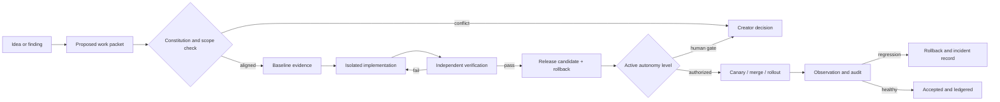

# Agent Operating Model

Version: 0.1 draft\
Goal: enable continuous background improvement without constitutional drift, save corruption, silent quality loss, or unrecoverable integration.

## 1. Governing principle

Agents receive autonomy over **bounded means**, not unbounded ends.

They may implement accepted features, repair defects, tune data inside approved ranges, optimize performance while preserving behavior, create quarantined assets, run experiments, and assemble evidence. They may not ratify the game's identity, weaken gates, rewrite history, silently change save semantics, or turn a failed experiment into a production dependency.

## 2. Authority matrix

| Action | Background agent | Verifier agent | Integrator | Creator |
|---|---:|---:|---:|---:|
| Read state, run diagnostics, file a proposal | Yes | Yes | Yes | Yes |
| Create a quarantined prototype | Yes | Yes | Yes | Yes |
| Implement an accepted low/medium-risk work packet | Yes | Review | Merge under active autonomy tier | Yes |
| Optimize while preserving golden behavior | Yes | Must independently verify | Merge under active tier | Yes |
| Add/retire a save field | Propose/implement migration | Must verify all golden saves | Merge only with migration evidence | May approve high risk |
| Change a constitutional invariant/pillar | Propose only | Analyze only | Cannot ratify | Ratify/reject |
| Weaken/remove a quality gate | Propose only | Cannot self-approve | Cannot approve alone | Ratify/reject |
| Ship an AI-generated asset | Prepare only | Validate provenance/art/runtime | Candidate only | Art approval or delegated approver |
| Delete ledger history or sole source asset | Never | Never | Never | Requires explicit exceptional operation |

## 3. Autonomy levels

Only one level is active at a time and it is recorded in the production ledger.

### A0 — Observe

Agents inspect, benchmark, simulate, and propose. They may edit draft documentation and draft control-plane records only when the creator explicitly requests that work. A0 forbids game/runtime/tool implementation, production or generated asset creation, dependency or engine installation, and implementation scaffolding. Every A0 edit remains an untrusted proposal and cannot authorize itself or advance autonomy.

### A1 — Quarantined experiments

Agents may create isolated branches/worktrees, prototypes, generated assets, and reports only after the A1 quarantine boundary is actually established. Nothing merges at A1; the creator manually inspects and imports or rejects the bounded diff/artifacts.

### A2 — Accepted work packets

Agents may implement creator/integrator-accepted work packets and assemble a release candidate. Independent verification and human merge remain required.

### A3 — Guarded integration

Low-risk fixes, tests, tooling, and semantic-preserving optimizations may auto-merge after all gates and independent verification. Feature behavior remains behind a default-off flag until review.

### A4 — Guarded rollout

Accepted low/medium-risk features may progress from internal flag → canary build → default-on after predetermined evidence and an observation window. High-risk, save-breaking, economy-wide, art-pillar, or constitutional changes remain human-gated.

The project remains at **A0** while this foundation is a draft. Repository creation does not promote autonomy. Only explicitly creator-approved packets may enter A1, and the canonical `a1_max_active_packets` value in [`governance/ratification-state.json`](governance/ratification-state.json) permits exactly one active A1 packet. Changing that cap requires a creator receipt plus an explicit schema/state revision; a receipt alone does not silently override the current value. Advancement requires the trusted gatekeeper in [`11-TRUST-AND-ENFORCEMENT.md`](11-TRUST-AND-ENFORCEMENT.md), the required packet mix, every failed/aborted attempt in the audit denominator, no unresolved serious incident, and a creator promotion receipt.

### Exact A1 activation preconditions

An A1-required packet may enter `active`, `verifying`, or `candidate` only when all of the following are simultaneously true:

1. `governance/ratification-state.json` maps the packet ID to exactly one entry gate.
2. The mapped gate is `passed`; every decision requirement resolves to its active supersession head, and every decision and receipt claim is value-matching, protected, and sealed.
3. The packet-specific quarantine receipt binds both `A1-QUARANTINE-BOUNDARY-VERIFIED` and `ACTIVATE-A1-<packet-id>` to that packet, its immutable packet-contract hash, and the exact raw SHA-256 of its canonical A1 boundary manifest. This is one physical-boundary approval, not an additional independent blocker.
4. Canonical `active_autonomy` is `A1`; `active_a1_packet_id` names the sole packet; and the same creator-issued activation receipt binds the current constitution hash, decision-ledger hash, and last sealed creator receipt ID.
5. The packet has a `held` reservation with the exact approved base commit, non-null lease ID, fencing token, and expiry later than the activation event, plus explicit path and state-domain ownership matching its declared scope.
6. The complete, unique, chronological status-event chain is retained from `null -> proposed`; every `active`, `verifying`, and `candidate` transition references the same activation receipt, including after release, rejection, or rollback.
7. Activating it does not exceed `a1_max_active_packets`; today that cap is exactly one.

Missing or inconsistent state keeps the packet proposed/accepted but non-executable. A passing bootstrap lint alone never activates A1.

## 4. Separation of duties

The principal-separation matrix in `11-TRUST-AND-ENFORCEMENT.md` is authoritative. At A1, sibling agents may implement and provide advisory review inside quarantine but cannot independently accept or integrate output; the creator owns the manual diff/import boundary. At A2–A4, every accepted packet—including low/medium work—requires pairwise distinct trusted implementer, verifier, and integrator principals. A single actor cannot implement and verify merely because another actor performs the merge.

Recommended roles:

- **Governor/planner**: converts an accepted objective into a bounded work packet and checks constitutional links.
- **Implementer**: changes the smallest coherent surface and adds tests/migrations.
- **Verifier/critic**: starts from the work packet, reproduces the baseline, attacks edge cases, and checks evidence independently.
- **Integrator/release agent**: resolves branch state, checks the full gate set, creates the release manifest, and performs or stages rollout.

Agents may rotate roles across packets, but at A2–A4 the implementer, verifier, and integrator roles may not collapse within any accepted packet, regardless of declared risk or change class.

## 5. Work packet lifecycle

The versioned JSON object conforming to [`schemas/work-packet.schema.json`](schemas/work-packet.schema.json) is the sole canonical packet. [`templates/WORK-PACKET.md`](templates/WORK-PACKET.md) is an authoring worksheet/read-only view and cannot authorize implementation or release.

## 6. Work packet readiness

A packet is not implementable until it contains:

- one measurable objective and player/production value;
- constitutional and decision-ledger links;
- explicit non-goals;
- baseline behavior/evidence;
- affected state domains and interfaces;
- save/schema impact;
- deterministic acceptance tests where applicable;
- visual/interaction evidence requirements;
- performance budget;
- dependencies and likely files;
- declared and diff-derived risk, with effective risk equal to the higher value;
- required approver, approval receipt, base commit, reservation/lease, and dependency graph;
- immutable `packet-contract-v1` hash and, for A1, a creator-attested boundary-manifest reference;
- feature-flag and rollout plan;
- structured health thresholds, observation minimums, rollback build/save recovery, and drill requirement;
- explicit dependency-release requirements; a dependent packet cannot advance until each dependency is released under a sealed creator completion receipt bound to that dependency's contract;
- risk class and required approver.

“Improve the game,” “make it prettier,” and “optimize performance” are not work packets.

## 7. Agent execution protocol

1. Read the constitution, active decision records, relevant system contract, and work packet.
2. Verify the baseline; if it cannot be reproduced, stop and amend the packet rather than inventing a new problem.
3. Acquire an atomic reservation with base commit, exact paths/domains/content IDs, expiry, heartbeat, and fencing token. Also reserve scarce Unity license/build/GPU-profiler runners when applicable.
4. Work in an isolated branch/worktree or asset package.
5. Preserve unrelated user changes and avoid broad mechanical rewrites.
6. Add or update tests with the implementation, including save migration if applicable.
7. Run fast gates continuously and full relevant gates before handoff.
8. Produce a content-addressed evidence manifest: commands, results, metrics, captures, state hashes, environment, actual changed paths, and known limits.
9. A different agent verifies from the clean packet and candidate, not from the implementer's narrative alone.
10. The integrator applies the active autonomy policy and records merge, rollout, rejection, or rollback.

Packet acceptance hashes only the immutable contract projection—identity, declared risk/save risk, scope, dependency IDs, scenario pins, tests, rollout, and rollback. Mutable status, reservations, actors, receipts, actual paths, evidence, verification, and release fields are excluded so later evidence cannot invalidate or silently redefine the accepted contract. `actual_paths` must remain covered by both declared and reserved paths. `verifying` and `candidate` require content-addressed diff, artifact-manifest, and command-log evidence.

## 8. Optimization loop

An optimization agent must preserve a declared semantic envelope:

- same input commands and random seeds;
- same authoritative end-state hash, or a pre-approved tolerance for continuous values;
- same player-visible ordering and feedback unless the packet says otherwise;
- no worse save size/migration behavior;
- no worse frame, memory, thermal, loading, or build metric outside stated tolerances;
- no new dependency without approval.

Optimization process:

1. capture baseline profiles and scenario hashes;
2. identify one measured bottleneck;
3. propose a bounded target and regression ceiling;
4. implement behind a switch when feasible;
5. compare identical scenario captures;
6. keep only changes that pass correctness and deliver meaningful measured value;
7. remove the switch/old path only after observation and a recorded cleanup packet.

Micro-optimizations without a measured bottleneck are rejected.

## 9. Feature rollout

Each runtime feature declares a stable flag in the protected registry with owner, default, dependencies, persistent-data behavior, save impact, and removal condition.

Recommended stages:

1. `dev-only`: callable only in test/development builds;
2. `internal-off`: present in normal builds, disabled by default;
3. `canary`: enabled for specific local save/profile or test cohort;
4. `default-on`: enabled for new games and migrated saves after evidence;
5. `settled`: flag removed in a later cleanup after rollback window closes.

Rollout records precommit exact cohort/profile, build/content/save hashes, minimum runs/play-hours, start/end, metric formulas/thresholds, failure triggers, required approver, rollback deadline, and rollback target. A trusted evaluator—not a packet-authored `pass` value—advances stages. There is no external telemetry collection until separately approved; local structured logs and opt-in playtest reports are sufficient initially.

## 10. Save-affecting changes

Risk levels:

- **S0 none**: no persistent data change.
- **S1 additive**: new optional/defaulted field or content.
- **S2 migratory**: transforms existing state or retires IDs.
- **S3 breaking/high-risk**: changes identity, ownership, ordering, random streams, inventory semantics, or removes recoverable meaning.

S2 requires migration fixtures, compatibility matrix, immutable pre-migration generations, cloned-profile canary, recovery tool, and all golden saves. S2 and S3 cannot auto-merge or auto-roll out at any autonomy level in this constitution draft.

Every migration is idempotent, version-to-version explicit, observable, and applied to a copy before replacing a user's save.

## 11. Asset-agent loop

Asset work remains in `ContentSource/Incoming/<packet-id>/` until it passes:

1. provenance/license scan;
2. file safety scan;
3. scale/pivot/naming/transform validation;
4. triangle/material/texture/LOD/collision/socket checks;
5. four-camera render sheet;
6. golden-lineup comparison;
7. engine import and performance check;
8. human art-direction acceptance.

The agent that generated or modeled an asset cannot be its sole art verifier.

## 12. Integration and contention

- One active packet owns a given state schema or migration chain at a time through an atomic reservation.
- Parallel agents may touch the same broad system only through declared interfaces.
- Integration order is based on dependency graph and save risk, not completion time.
- Conflicts are resolved by the integrator using the source-of-truth order; never by destructive reset.
- Broad refactors freeze feature work in the affected seam and require a migration map.
- A failing packet may retry with new evidence. The protected event ledger defines equivalence by unchanged objective/root-cause class and records every proposed, started, aborted, failed, rolled-back, and accepted attempt; after three equivalent failures it returns to planning.

## 13. Incident and rollback law

Rollback triggers include:

- save corruption, lost identity, or failed migration;
- constitutional invariant violation;
- deterministic scenario divergence without approval;
- crash or soft-lock in the accepted path;
- performance beyond the declared regression ceiling;
- broken asset provenance;
- inability to explain or reproduce the resulting state.

Rollback procedure:

1. disable the feature flag or restore the declared rollback build only if its compatibility matrix can read the current save; otherwise restore the immutable compatible generation with explicit progress-loss disclosure;
2. preserve the failing build, logs, save copy, seed, and state hash;
3. create an incident record with causal scope;
4. add a regression fixture before reimplementation;
5. never “fix” the only affected user save in place without preserving it.

## 14. Background queue priority

The queue may use the following heuristic only after each factor has a protected 1–5 rubric, dependency/aging rules, and risk floor:

`constitutional value × player pain/opportunity × evidence confidence × reversibility ÷ risk and cost`

Priority order during early production:

1. correctness and save integrity;
2. blocked core-loop proof;
3. usability/readability;
4. performance on target hardware;
5. art consistency and asset throughput;
6. content/feature expansion;
7. speculative polish.

Agents may discover work but may not let an easy polish queue starve a failing constitutional proof.

## 15. Promotion to sustained background operation

The loop is not “ready” because an agent can commit code. It is ready when:

- the six required bounded packet classes and the rollback drill complete under the protected event ledger, with all failed/aborted attempts visible;
- at least one packet includes a successful save migration;
- at least one includes a measured performance optimization with semantic equality;
- at least one quarantined asset passes the full art pipeline;
- a deliberately injected failure triggers a clean rollback;
- a clean clone reproduces tests and native build;
- the creator confirms that the accepted changes did not alter the game's identity.

No promotion occurs with an unresolved save/constitutional/release incident, and only a creator receipt changes the active autonomy state.
